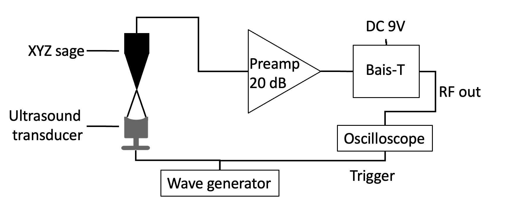
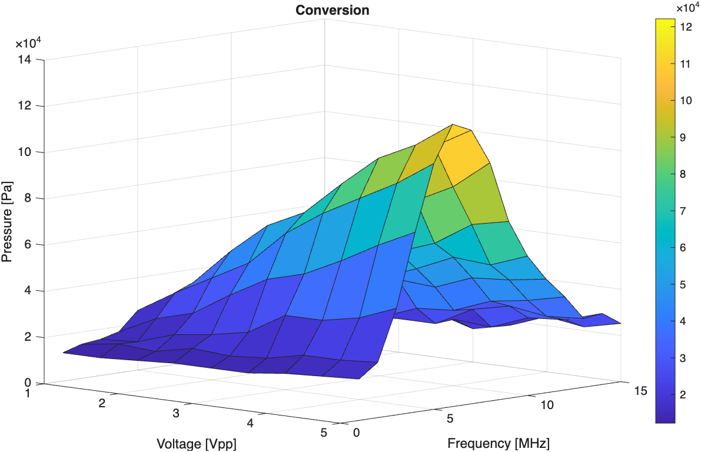
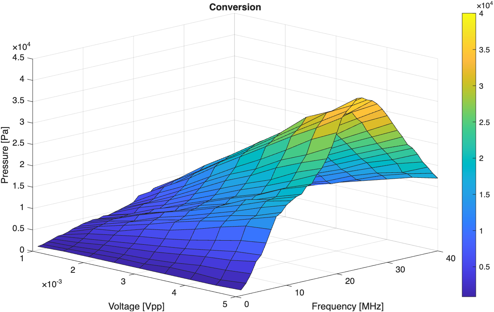

# Ultrasound transducer characterization 
The experimental setup used to characterize the ultrasound transducer is composed of a high-frequency wave generator, an oscilloscope, and a hydrophone connected to a preamplifier; the hydrophone is connected to the XYZ stage to precisely align with the focal zone of the focused ultrasound beam. The scheme below shows the experimental setup:

The ultrasound characterization was done by measuring the pressure of the ultrasound wave as a function of the frequency and excitation amplitude. The code in this repository communicates with both the wave generator and the oscilloscope through dedicated classes, and the main script integrates the wave generator, the hydrophone response, and the oscilloscope:

1. The main control script: `Main_control_sweep_code.m`
2. Wave generator class: `DG5000Pro.m`
3. The oscilloscope class: `T3DSO2502A.m`
4. The signal analysis script: `analysis.m`

The code was written by master's student Martina Grandi during her internship and modified by me, with changes to the high-frequency wave generator.

  
  

